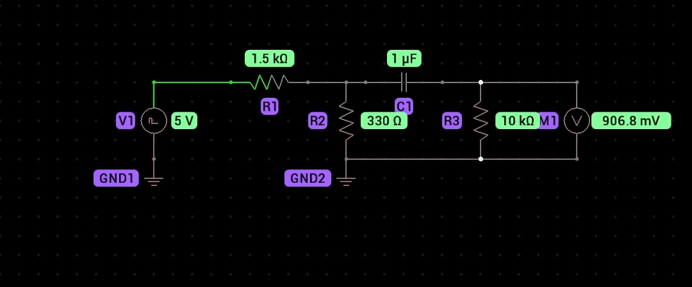

## Kinovea vibration trigger research 

Turned out this method is overly complex.  All I needed to do was use the SW-420 vibration switch by itself across the microphone input cord.  The DC voltage supplied by the microphone input is sufficient to trigger a “loud” sound by just shorting (or unshorting) the connection.  

  
  

V1 in the above is actually a SW-420 vibration switch module with sensitivity setting and digital output. 

The voltmeter on the right of the circuit is the output which needs to connect to the pc through a TRS connector. 

  

Vcc input to the device is 5v from a usb connector. 

  

Output connects to a TRS connector per the diagram below. 

