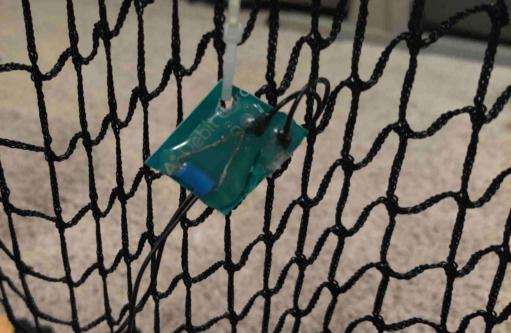

## Kinovea vibration (Shock) based audio trigger

This project creates a different type of “microphone” that isn’t triggered by sound, but instead by vibration such as a net moving back and forth after something hit it (golf ball, baseball, disc golf disc, or whatever you want as long as you can attach this device and it causes a movement).  This new “microphone” goes into a standard microphone jack on any computer and can be used with Kinovea’s audio trigger feature to trigger a video recording.  

  

### The upside to this is that we can trigger Kinovea in a much more reliable way that doesn’t give nuisance trips by other noise in the room as the audio trigger tends to do.

  

End result:  (device hanging from a net that can detect vibrations of the net and trigger Kinovea to capture video)

  

  

Kinovea automation to set up audio trigger:

  

Some info on the SW-420 to give an idea of how this thing works:

  

**Theory of operation:**

Basically all we’re doing with this is shorting the microphone input and when a vibration occurs, the SW-420 breaks the short momentarily which creates a transient on the microphone input which registers like a “loud” noise.  

For the electrical / audio engineers reading this, this may seem senseless, but most microphone inputs supply a DC output voltage to provide power for certain types of microphones (in my case I was getting about 4.7V from my mic input).  The DC output provided is a very limited current so we’re not going to be breaking anything here by shorting it (these things are designed for this).  The trick is that the microphone input is AC coupled, which is to say it basically has a capacitor in series with it.  What this means is while we’re shorting the connection, the DC voltage goes to 0 immediately, and the AC voltage also eventually decays to 0V (more on that in a moment).  When the SW-420 is “jiggled” the connection opens momentarily and that 4.7V DC signal suddenly appears and starts charging the AC coupling capacitor.  The AC coupled voltage is basically the voltage that the mic input on the computer sees and what it looks like is a large voltage surge that then slowly decays back to 0 when the SW-420 goes settles back down and shorts the connection again.  Even if the SW-420 got stuck in the wrong position (open) it doesn’t matter because the next time it jiggles, the change in state will still look like a large transient and thus a loud noise.  (Note I did find in testing the SW-420 does sometimes get stuck in the open state, but as long as a jiggle causes it to momentarily change state to anything different from what it is then we still get the trigger).  Kinovea doesn’t know the difference.  It just senses an audio level that was basically nothing and is suddenly something.

  

## How to assemble one:

**Equipment needed:**

1. 3.5mm Microphone input on your computer.  If you don’t have this you’ll have to get a USB stereo adapter with 3.5mm microphone input (pink) and 3.5mm stereo output (green).  You don’t need the stereo output for this, but it’s basically free and probably hard to find one without that.  Note you want a TRS one, not TRRS.
    - Here’s an example I found without much research.  I don’t use this and have no idea if it’s any good, but wanted to show an example of what you’re looking for.
    - [https://www.amazon.com/gp/product/B00IRVQ0F8](https://www.amazon.com/gp/product/B00IRVQ0F8/ref=ox_sc_act_title_1?smid=A29Y8OP2GPR7PE&psc=1 "https://www.amazon.com/gp/product/B00IRVQ0F8/ref=ox_sc_act_title_1?smid=A29Y8OP2GPR7PE&psc=1")
2. A pair of old junk headphones you’re going to destroy or otherwise you can just buy this:  
    - [https://www.amazon.com/gp/product/B09WTX292B](https://www.amazon.com/gp/product/B09WTX292B/ref=ox_sc_act_title_1?smid=AMGCM6C9XYDRR&psc=1)
3. SW-420 vibration sensor
    - [https://www.amazon.com/gp/product/B07S8HGZKQ](https://www.amazon.com/gp/product/B07S8HGZKQ/ref=ox_sc_act_title_1?smid=A1THAZDOWP300U&psc=1)

  

  

**How to build:**

1. Start with a standard pair of headphones (skip this if using replacement 3.5mm to bare end wire cable)
2. Destroy the plastic housing around the headphone part being careful not to mess with the wires.  (You don’t want to cut the wires).  I don’t have a picture of this, but de-solder the speaker part with a soldering iron which will make re-soldering easier later on.  If you cut the wires you’re going to have a harder time soldering to the wires, but it’s still possible.  
  
3. Solder the SW-420 across the red wire to the copper wire (or black wire if using the 3.5mm replacement wire).  
  
  
4. Hot glue the whole mess to something rigid (I used an old credit card)  
  
5. Final result.  I drilled a hole in it to put a zip tie through and hot glued the wires to the back to add strain relief also.  
